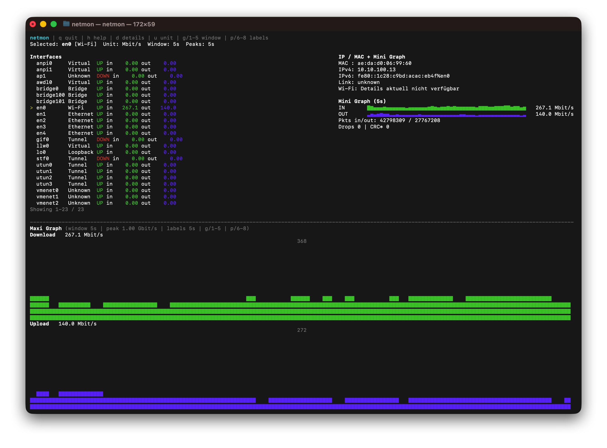

# netmon

`netmon` is a high-performance, interactive CLI network monitor for macOS.

## Why I Built It

I have used `bmon` very often for years and really like its terminal-first workflow.
For my day-to-day macOS debugging, I wanted a tool with more features and a faster refresh loop, plus richer interface metadata (IP, MAC, Wi-Fi details) directly in the same view.

`netmon` is that tool.

## Example



## Features

- Live bandwidth per interface (in/out) with terminal graphs
- Shows all local interfaces (Ethernet, Wi-Fi, Loopback, Tunnel, Virtual)
- Interface selection with arrow keys (Up/Down)
- IP and MAC display per interface (when available)
- Switchable units (`Kbit/s`, `Mbit/s`, `Gbit/s`, `KB/s`, `MB/s`)
- Additional counters: packets, errors, drops, collisions, CRC approximation
- Wi-Fi details (when available): SSID, RSSI, noise, SNR, TX rate
- Top mini graph + bottom maxi graph with time window toggle (`live`, `5s`, `10s`, `30s`, `5m`)
- Fixed maxi-graph reference scale (`1 Gbit/s` baseline, higher only when link speed is detected above 1 Gbit/s)
- Configurable peak labels in the maxi graph (`5s`, `10s`, `15s`)

## Controls

- `Up` / `Down`: Select interface
- `u`: Switch unit
- `g`: Cycle graph window
- `1..5`: Set graph window directly (`live`, `5s`, `10s`, `30s`, `5m`)
- `p`: Cycle peak-label interval
- `6..8`: Set peak-label interval directly (`5s`, `10s`, `15s`)
- `d`: Toggle detail view
- `h`: Toggle help popup
- `q`: Quit

## Build

```bash
swift build --disable-sandbox
```

If your environment has restrictive SwiftPM cache permissions, this command is more robust:

```bash
HOME="$PWD/.home" \
SWIFT_MODULECACHE_PATH="$PWD/.build/module-cache" \
CLANG_MODULE_CACHE_PATH="$PWD/.build/module-cache" \
SDKROOT=/Library/Developer/CommandLineTools/SDKs/MacOSX15.4.sdk \
swift build --disable-sandbox --scratch-path .build --cache-path .swiftpm-cache
```

## Run

```bash
swift run --disable-sandbox netmon
```

or directly:

```bash
./.build/debug/netmon
```

## Notes

- `CRC` is currently approximated via input errors.
- Wi-Fi details rely on macOS system tooling and are only shown for detected Wi-Fi interfaces.
